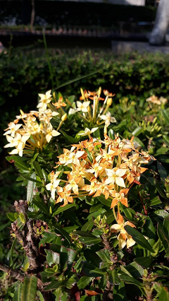
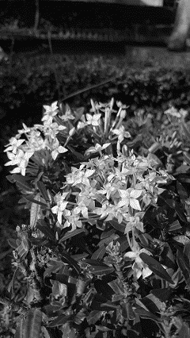
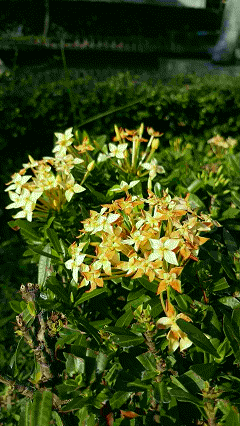

# b&w-color codec
A script that converts images into black and white (grayscale), and encodes color information in the least significant bit.

### Backgrounds
I came across an AI that can encode color in grayscale images one day. I also have a surface level knowledge of composite video. So, I was inspired by both of them to create something similar. I don't know much about coding, but I've heard that Python is good for beginners, so I used it in my program. This was my first serious attempt at writing code. I have to go to Google and look up how to program. Please let me know if there is anything I can do better!

## To do
* [ ] ~~Add a GUI~~
* [ ] ~~Make it into a program~~
* [ ] ~~Clean up the code~~
* [ ] ~~Store the bit ratio in the file somehow~~
* [ ] ~~Add command line parameter~~
* [ ] ~~Add batch processing capability~~
* [ ] ~~Think of a more creative name~~
* [X] ~~Get rid of purple tint when dithering color~~

(oops, this repository is abandoned)

## Prerequisites
* [Python3](https://www.python.org/downloads/)
	* Numpy
	* Pillow
	
## Running
Download and install Python. Then execute `pip install numpy pillow`. Now, extract the archive to a convenient location. You can copy the images you want to convert and save them in the same directory for convenience.

## Usage
### Encoding
Type `python encode.py` (or `python encode_fs-dither.py` if you want to use floyd-steinberg dithering) and then enter the path to the image file you want to convert. Then, enter the number of bits to be used for Y'. The default value is 4. More bits for Y' result in a better grayscale image but a lower color quality. If you run `encode_fs-dither.py,` you'll be asked if you want to dither. The output filename will end with "_b-w" or "_b-w_dither".
### Decoding
Type `python decode.py` and enter the path to the image file you want to convert. Then, enter the number of bits used for Y'. The default value is 4. The output filename will end with "_color"

## Examples
| Original image | Converted to grayscale and dithered | The same image, converted back to color |
| --- | --- | --- |
|  |  |   |

## Contributing
Contributions, issues and feature requests are welcome. 
Feel free to check [issues page](https://github.com/RainDownpours/b-w-color-codec/issues) if you want to contribute.

## Author
Rain Downpours
* Github: [@RainDownpours](https://github.com/RainDownpours)

## License
Copyright (c) 2022 [Rain Downpours](https://github.com/RainDownpours) 
This project is [MIT](https://github.com/RainDownpours/b-w-color-codec/blob/main/LICENSE) licensed.
